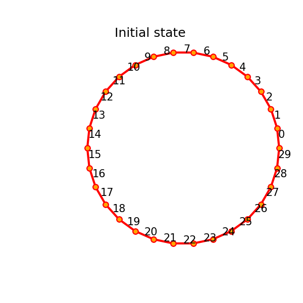
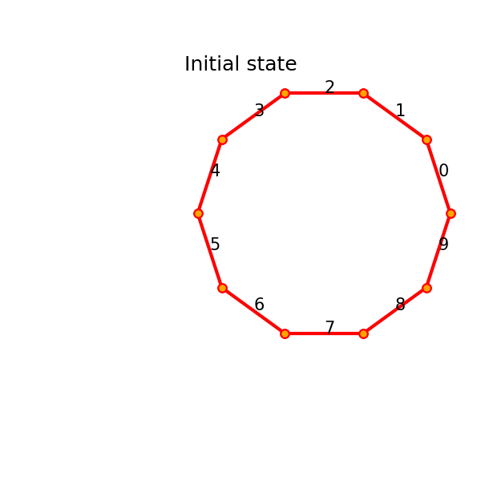
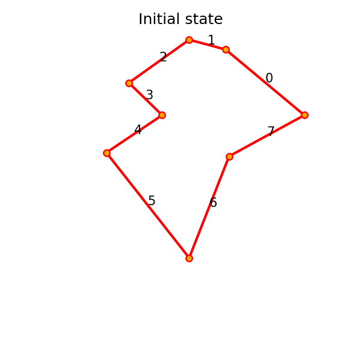
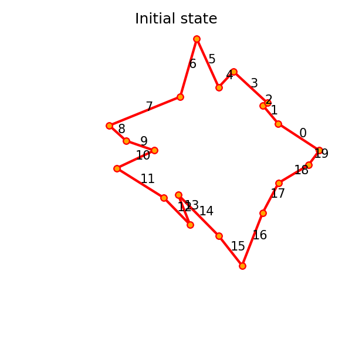
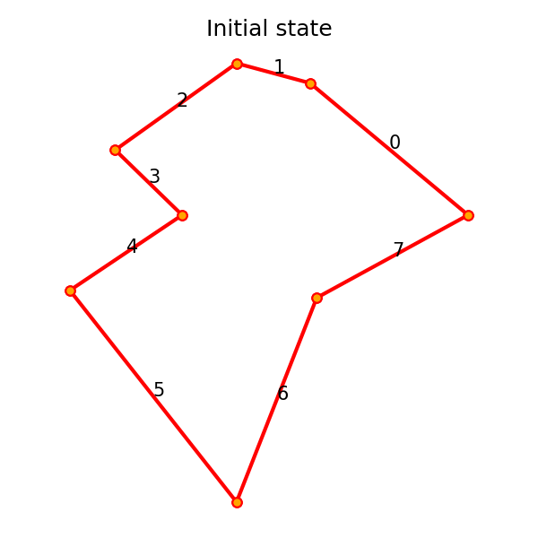
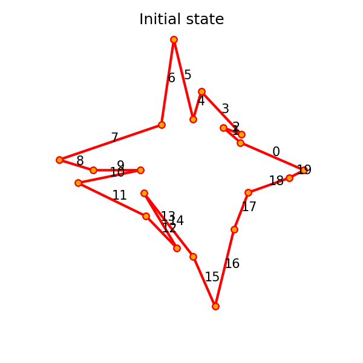
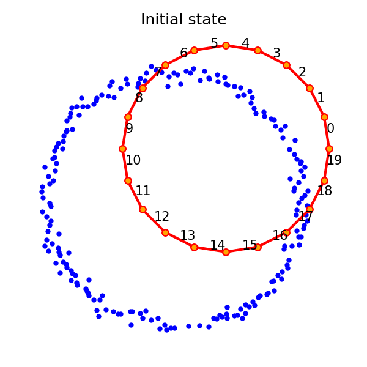
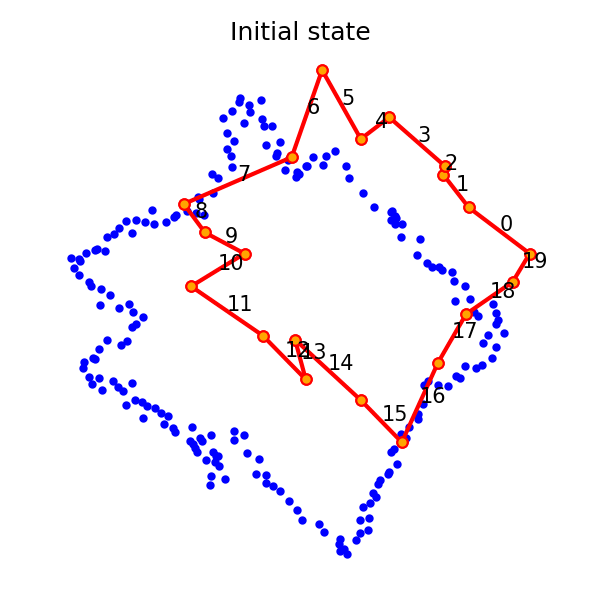

## Slides presented during the meeting

- [Slides without notes](../slides/2026_04_20-monthly/main-handout_no_notes.pdf)
- [Slides with notes](../slides/2026_04_20-monthly/main-handout.pdf)

### GIFs that could not be included in the slides

:::: {#fig-illustrations-deformation layout="[[1,1]]"}

{group="illustrations-deformation"}

{group="illustrations-deformation"}

Simple illustrations of the polygon deformation algorithm.
:::

:::: {#fig-illustrations-deformation-complex layout="[[1,1]]"}

{group="illustrations-deformation-complex"}

{group="illustrations-deformation-complex"}

More complex illustrations of the polygon deformation algorithm.
:::

:::: {#fig-illustrations-self-intersections layout="[[1,1]]"}

{group="illustrations-self-intersections"}

{group="illustrations-self-intersections"}

Illustrations of self-intersections with the polygon deformation algorithm.
:::

:::: {#fig-illustrations-matching-points layout="[[1,1]]"}

{group="illustrations-matching-points"}

{group="illustrations-matching-points"}

Simple illustrations of the full polygon deformation algorithm.
:::