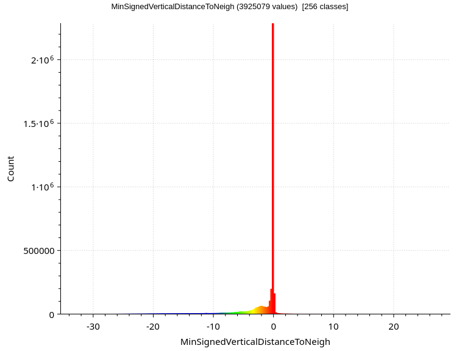
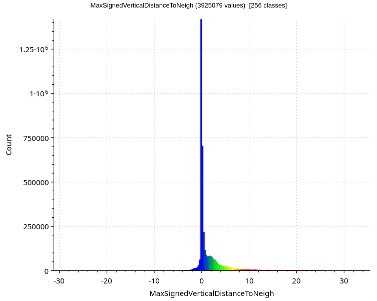
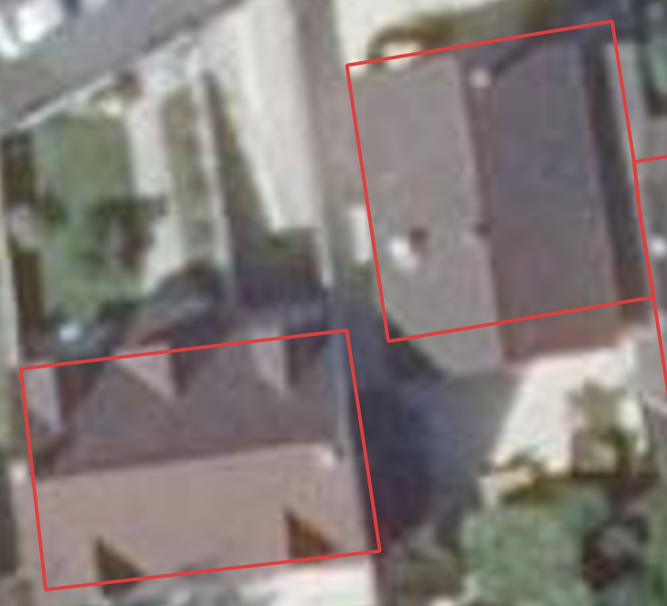
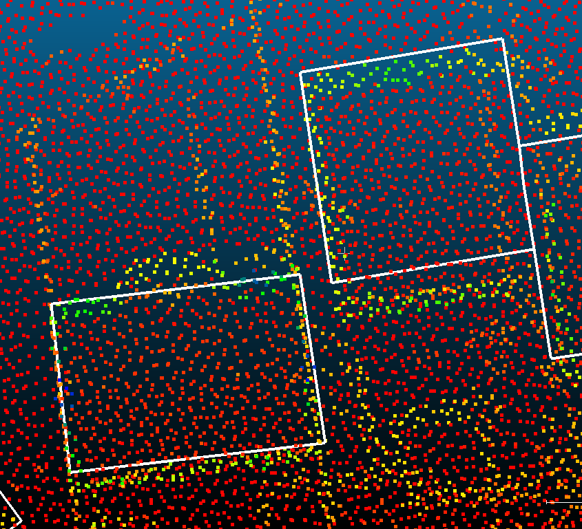
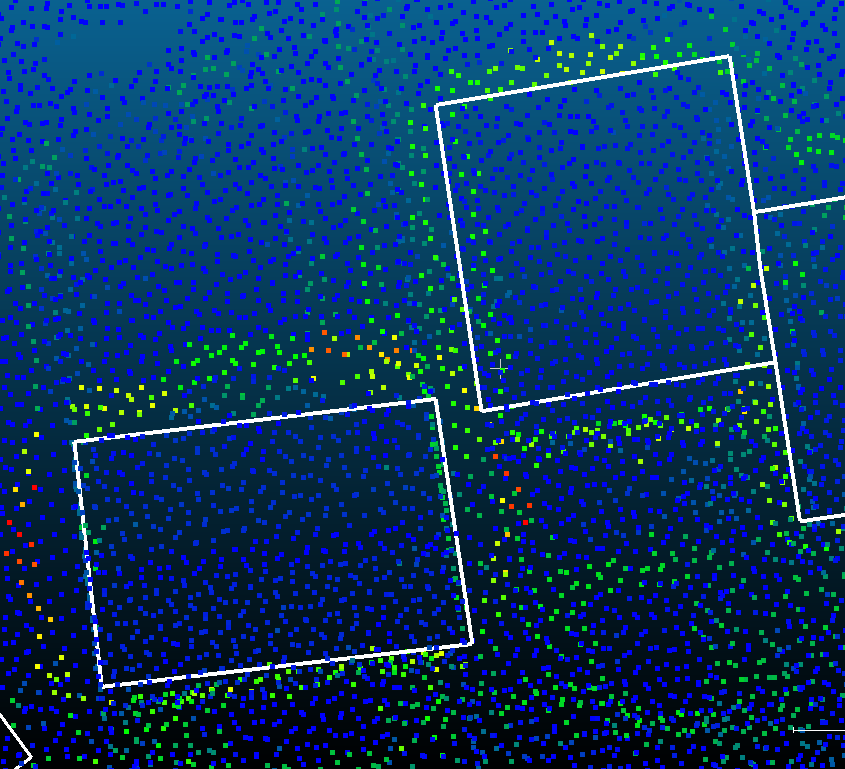
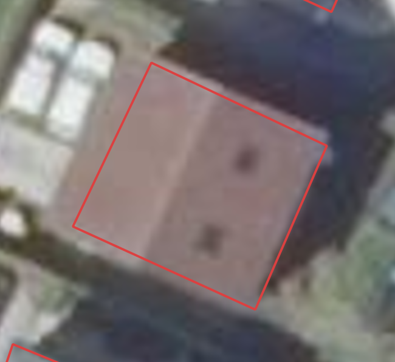
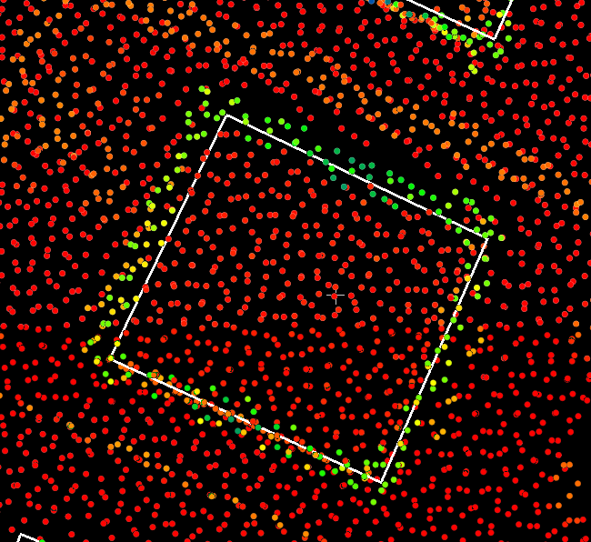
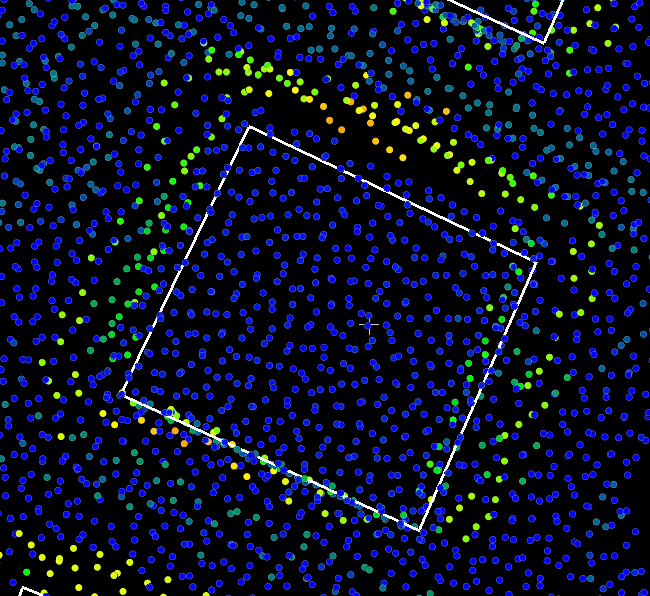

## Results since previous meeting

- Worked on the computation of a meaningful distance in point acquisition order to identify roof edges
- Tried to set up the laptop provided by the IGN (not working yet)

## Material for discussion

### Definition of the minimum/maximum signed vertical distance to the neighbours

I computed for each point $p$ in the point clouds two signed distances, that I call **minimum/maximum signed vertical distance to the neighbours** ($\text{misvdtn(p)}$ and $\text{masvdtn(p)}$).
These distances are computed through the following process:

1. Order the points in the point cloud using their GPS time.
    Multiple returns give multiple points with the same GPS time, but the order between them does not matter.
2. For each point $p_1$ of GPS time $t_1$:
    1. Find the previous ($t_0$) and the next ($t_2$) GPS times in the data, with all the associated points ($S_0 = \{p_{00}, ..., p_{0k}\}$, $S_2 = \{p_{20}, ..., p_{2k}\}$).
    2. If $|t_2 - t_1| \gt \text{MAX\_TIME\_DIFF}$, set $S_2 = \emptyset$.
        Same for $t_0$
        This avoids computing the distance between two points that were simply the last and first point of consecutive scans.
    3. Compute the signed vertical distance $\text{svd}(p_1, p)$ from $p_1(x_1, y_1, z_1)$ to each point $p(x, y, z)$ in $S = S_0 \cup S_2$, i.e. $$\text{svd}(p_1, p) = z - z_1$$
    4. Then, $$\text{misvdtn}(p_1) = \begin{cases} 0 & \text{if } S=\emptyset \\ \min(\text{svd}(p_1, p) \; \forall p \in S) & \text{otherwise} \end{cases}$$ and $$\text{masvdtn}(p_1) = \begin{cases} 0 & \text{if } S=\emptyset \\ \max(\text{svd}(p_1, p) \; \forall p \in S) & \text{otherwise} \end{cases}$$

As a result, $\text{misvdtn}(p)$ allows to identify points that are significantly higher than one of their neighbours, and $\text{masvdtn}(p)$ allows to identify points that are significantly lower than one of their neighbours.
Therefore, both values are expected to be high in absolute value on the boundaries of roofs, with $\text{misvdtn}(p)$ being low (high in absolute value) for the first/last point on the roof, and $\text{masvdtn}(p)$ being high (high in absolute value) for the last/first point on the ground before the roof.

### Examples

I computed these two values for an area in Ozoir-la-Ferrière, France with the LiDAR HD.
Below are a few interesting examples of buildings.
Based on [this classification](https://lidarmag.com/2025/12/28/airborne-lidar-a-tutorial-for-2025-4/), the scanner geometry of the LiDAR HD in this area is similar to the Palmer scanner, giving circular scans with a radius of around 500 m.
Below in @fig-examples-legends are the legends for the values of the minimum/maximum signed vertical distance to the neighbours, with a colour scale limited respectively to $[-10, 0]$ and $[0, 10]$ meters for better visualisation.

:::: {#fig-examples-legends layout="[[1,1]]"}

{group="examples-legends"}

{group="examples-legends"}

Legends for figures below.
:::

To get an idea of the footprint and roofprint that could be built based on these values, the points in yellow/green should be used, but the outer boundary of these points should be used for $\text{misvdtn}$ to give the roofprint, and the inner boundary for $\text{masvdtn}$ to give the footprint.

:::: {#fig-example-1 layout="[[1.5,1], [1,1]]"}

.](./2026_02_09/Example_1-Street_view.png){group="examples-1"}

{group="examples-1"}

{group="examples-1"}

{group="examples-1"}

First example (address: 52 Av. Mellerio, 77330 Ozoir-la-Ferrière; coordinates: (676390, 6852281))
:::

:::: {#fig-example-2 layout="[[1,1], [1,1]]"}

.](./2026_02_09/Example_2-Street_view.png){group="examples-2"}

{group="examples-2"}

{group="examples-2"}

{group="examples-2"}

Second example (address: 58 Av. du Général Leclerc, 77330 Ozoir-la-Ferrière; coordinates: (676104, 6852326))
:::

### Questions

- Having many points on a façade is annoying in our case because it means that the distances between them will be smaller.
    How to solve this issue?
- How to set up the monthly meetings with more people (Ravi, people from IGN)?

## Discussion

- The values are computed seem promising but to identify the roof edges more precisely, we need to only identify the point at boundary for each line of points, and not all the points that are significantly higher/lower than their neighbours.
    Then, an estimation of a point on the roof edge can be computed, depending on whether the point is multi-echo or not
- It would be great if there was a simple way to identify whether each façade is seen or not, to then use different strategies to identify the footprint.
    For this purpose, getting the optical centres of the scanner would be very useful.
- In cases where there is a dense set of points on a façade, the methods based on distances won't work, so another strategy will be needed.
    One solution could be to compute the normal vector of the points to identify the points on the façade.

## Work until next meeting

- [x] Separate the multi-echo from the single echo points to precisely estimate the roof edges
- [ ] Separate the cases where the façade is seen or not
- [x] Retrieve the optical centres (ask Wu Teng)
- [x] Send an invitation to the monthly meeting to Ravi, people from the IGN, etc
