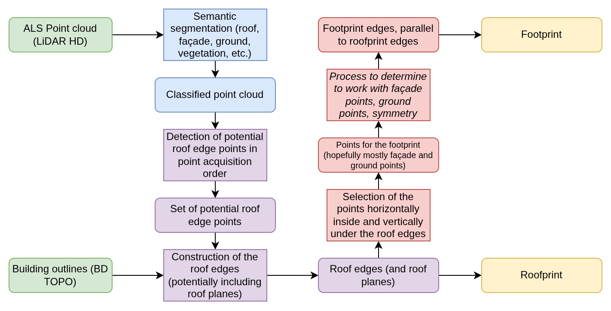

## Results since previous meeting

- Improved the setup of the project (mainly C++ and its dependencies)
- Installed and set up the IGN laptop
- Improved the process of identifying roof edges, separating multi-echo from single echo
- Created a script to extract single scanner lines randomly from an input LAS file (for visualization purposes)
- Made a small script to read the BD TOPO as GeoParquet

## Material for discussion

### Overview of the pipeline

:::: {#fig-overview-pipeline}

:::

### Questions

- There are often points with a number of returns higher than 1, except the other returns are missing.
    How is this possible?
- Sometimes we have two successive points with a number of returns higher than 1 on the roof.
    How is that possible?

## Discussion

## Work until next meeting

- [ ] Separation of cases based on the angle of the points
- [x] Find situations with missing points of multiple returns and successive points which hit the roof and the ground
