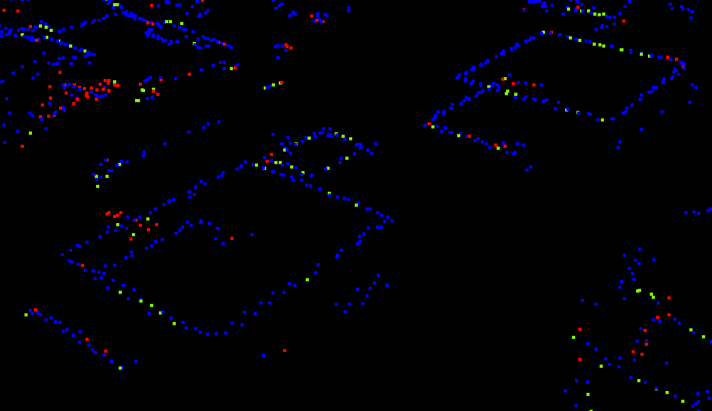
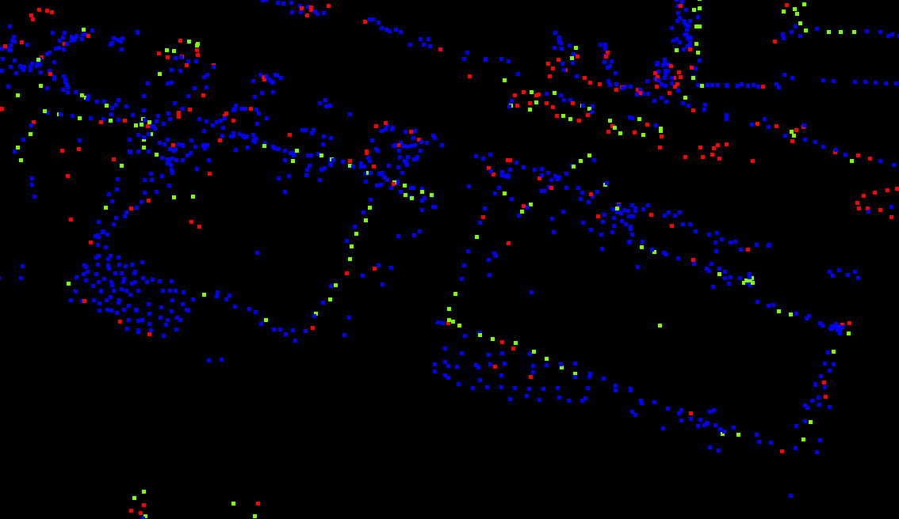

## Results since previous meeting

- I was sick last week so I was not very efficient and did not work at all on Friday.
- I now use either of these two methods to compute a theoretical edge point $p_e$ in case of a single echo giving a point $p$:
  - If the three previous points are almost aligned, I add half of the vector between the last and the previous last points to the last point to get my theoretical edge point $p_e$.
  This assumes that the previous points are on the roof and the roof is flat so we can simply follow the direction of the roof.
  - Otherwise, we use the calculated trajectory of the scanning vehicle to approximate the position $p_s$ of the scanner at the GPS time of the point of interest $p$.
  Then, the average direction between the real edge point $p$ and the ground point $p_g$ is calculated:
  $$ v_e = \text{normalize}\left(\frac{\text{normalize}(p - p_s) + \text{normalize}(p_g - p_s)}{2}\right) $$
  Finally, the theoretical point on the edge $p_e$ is taken in this direction at the same distance as the point on the roof $p$:
  $$ p_e = p_s + \text{norm}(p - p_s) v_e $$
- I also looked into computing normals and planarity measures on the point cloud to see whether these could be used, but I was not really convinced by results.
  It looked to me as if small imprecisions prevented flat objects to be really flat in the point cloud, which is surprising.
- Finally I made a Python script to download the tiles corresponding to a bounding box.

## Material for discussion

### Edge extraction in 3D

I tried to look into extracting edges in 3D without the BD TOPO as a guide but I am not sure how to do it.
I have mostly thought about RANSAC and Region Growing but I am not sure which one to try.
In many situations there are clear and visible lines of points, so RANSAC seems too complex for what we really need.
In others there are many other points that we need to ignore for the edges.
I think that weighing the points for methods like RANSAC based on their classification could help (more weight for class Building than for Unassigned)

::: {#fig-edge-points layout="[[1,1]]"}
{group="edge-point"}

{group="edge-point"}

Extracts of the computed edge points for a single flight axis. The colour corresponds to the type of points: blue points are real points from the input (multi-echo) while red and green points were computed from single echo points as explained above. Green corresponds to the alignment method and red to the half-angle method.
:::

### Ideas

- Consider neighbours in the direction of the flying vehicle, in order to handle situations where the ray is parallel to the façades.

## Discussion

- I need to find ways to identify points that are really on the roof in order to be able to identify the roof edges and discard points that were on balconies, on trees, etc

## Work until next meeting

- [ ] Try to group edges with angles too close to 180° to match them together (see the code from Amine)
- [ ] Look into ways to properly identify the points on the roof edges
  - [ ] Use the alignment of the point with the previous points to determine how certain it is that the point is a roof edge.
- [ ] Ask Wu Teng about sensor topology (regular 2D structure on a point cloud based on acquisition regularity).
  Compare the results with ScanAngle and using the estimated position of the scanner.