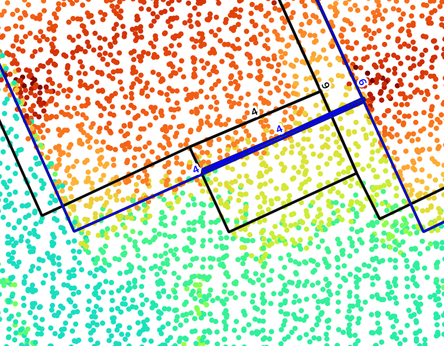
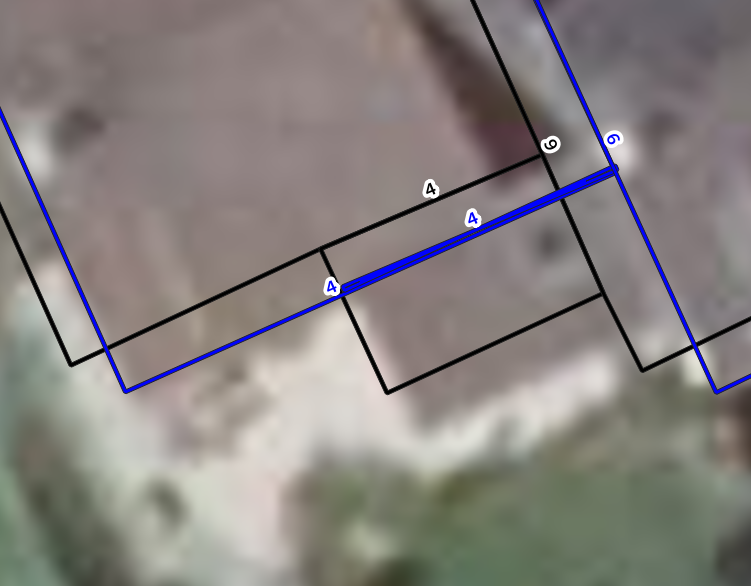

## Results since previous meeting

- **Reorganized a lot of code** to use CGAL geometry capabilities and to allow for processing **point cloud topology in different directions**.
- Fixed the issue with the **many bad edge points** created on the sides of the point clouds (due to the ellipsoidal geometry having a density per scan line that decreases towards the sides).
- Discussion with Wu Teng lead to **new ideas to identify roof plane edges** (see [Plane detection](#plane-detection) below).
- Tried fitting a line with **PCA without success**, because it was difficult to identify the points we want to use a a neighbourhood and it is very sensible to outliers.
  However, separating flight axes and using topology could make it better, because mixed flight axes seem to contribute to the issue.
- Using the **height of a point** to give it **more weight** in fitting the roof edges seems to improve the results.
  However, it can also introduce issues where the edge of a neighbouring building is more likely to be selected if it is higher

## Material for discussion

### Ideas

- Process points in **other directions** than scan order (such as perpendicularly to it)
- Matching **longer edges first** may help matching the smaller edges properly, if we shift the starting point of the neighbouring edges
- Use the **classification** of the points in combination with the outlines to **crop** the point clouds better.
- Use some kind of RANSAC locally for each edge to be able to locate edges in 3D.
  This can be especially useful for high buildings which give many edge points at every level due to balconies.
- For visualization of results, possibility to use iTowns to visualize the point cloud and the roofprints?

### Sliver roofprints

#### Combinatorial optimization

Some **combinatorial optimization** could help to get a correct output in some cases, especially for small buildings where otherwise you can easily match two opposite edges to the same spot.

:::: {#fig-sliver-roofprints layout="[[1,1]]"}
{group="sliver-roofprints"}

{group="sliver-roofprints"}

Example of a computed roofprint where both opposite edges matched the same set of points. The black lines come from BD TOPO and the blue lines from the algorithm.
:::

It could also help to prevent matching an edge to points that are further away simply because the score is higher.
Here is a list of potential measures that could help guide the optimization process:

- Total score of the edge (computed in a RANSAC-like way with inliers and weights given to points)
- Preservation of the area / coherence of the individual shifts
- Proximity of the edges that should be connected

Such an optimization **could be costly for large buildings**, but if we only take only the possibilities that reach a **minimum score** such as 50% of the best, with a **minimum distance** between the propositions that could be something like 30 cm, we should get 1 proposition for most edges and **we can hope that it does not explode**.

#### Other ideas

- Using the **repartition of points on the line** as an indication could help as well.
  This could prevent getting high scores somewhere because there is a high concentration of points to prefer a better and more reliable distribution on the whole edge.
- Being able to tell **where the matched segments start and end** could also help, because it would allow to check how close they are to reconstruct a better building.

### Plane detection

Detecting planes in some way could be very beneficial to identify edge points, split roof planes and exclude points on façades for roofprints.
I first thought about using something like RANSAC or RegionGrowing, and I expect that using the point cloud topology cound help in determining which points to use to compute normals and find seeds, which are crucial parts of these algorithms.
Then Wu Teng told me about his paper using Cross-Line Elements, which could be a very good method to identify the edges of any plane and not only the edges of the roofs [@Wu2016].
Combining this method and my current method could help identifying the most promising points.

His method is close to the idea I had to approximate a line around each point in scan line order (take previous and next).
Variations of this line could then indicate limits of roof planes.

However it is unclear if and how to handle the point clouds with ellipsoidal topology.
Because in this case the points are not really aligned, so handling lines in this case would be slightly different.
I can first assume that the variation is small enough and it should not matter, but for large buildings it may matter.
And there is no obvious solution to this, because trying to project the points in some way to have them in the cone defined by the scanner would likely lose the planarity of the points (i.e. coplanar points in 3D would not be aligned in this new 2D space).

### Questions

- Do we want to be able to process any type of LiDAR scanner?
  Do we want to start with one or more specific types and set these as the priorities?
- Should I start looking into point cloud semantic segmentation now or soon?

## Discussion

- My vision of the point cloud topoloy as a set of neighbours for each point (therefore defining an oriented graph) instead of a plain raster can be a good idea to get two mostly perpendicular directions for every point, especially on the sides of ellipsoidal LiDAR scans.
- Adding a penalty to offsetting the edges could help preventing moving the edge a lot when the certainty is low.
- Running the matching algorithm multiple times could help too.
- No need to try to handle $\mathcal{C}^1$ discontinuities in roofs, even if the BD TOPO has such differentiations.
  In this case, the penality added to the offset could be helpful.
- Since we do not care about $\mathcal{C}^1$ discontinuities, the algorithm of Wu Teng with Cross-Line Elements seems a bit redundant.
- Computing the score of the offset for a given edge by also adding the score of its two neighbours could help positioning small segments better, because even if these don't see a big difference, their potentially longer neighbours could.
- In cases where the edges are shifted like the algorithm we do, the simplest way to get topologically correct polygons again is to shift vertices by the sum of the two computed shifts

## Work until next meeting

- [ ] Gather somewhere all the ideas I have/had to get a better overview
- [x] Ask about going to Saint-Mandé on Wednesday
- [ ] Try to experiment with the new ideas for the matching algorithm:
  - [ ] Penalty to offsetting the edge
  - [ ] Computing the metric for multiple edges grouped together
  - [ ] Running the algorithm multiple times in a row
  - [ ] Adding the two neighbours to the metric computation
  - [ ] Properly join neighbour edges that are almost collinear
  - [ ] Add as a criterion to the line coverage, especially for the neighbours
- [ ] Process the point cloud in perpendicular direction to the scan lines as well
