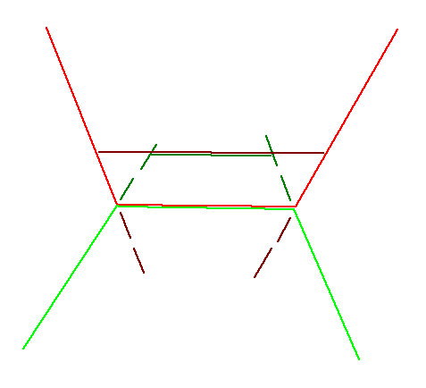

## Results since previous meeting

## Material for discussion

### Potential loss of topology with the edge translations

I found a situation where my current algorithm to translate edges would result in a loss of topology.
The illustration below show a situation where the problems occurs twice for the same pair of buildings.

{group="loss-topology"}

In this figure, the initial buildings are shown in light colours.
They share a common edge, so two vertices.
When translating the edges, the points follow the directions of the neighbouring edges, which mean that if the neighbouring edges are not collinear, the points will be translated in different directions for the two buildings.
This results in each shared vertex not being shared any more at the end of the process.

One solution to keeping the topology would be to also translate the neighbouring edges.
However, this would also require to look into the constraints of the neighbouring edges, and potentially keep going further and further if the neighbours also have constraints, which could be costly and complex to implement.

The potential good news is that if the process runs correctly until the end, and if the edges vertices are actually shared, then they should end up relatively close to each other, and we could potentially merge them back together if they are within a certain distance.
Therefore I don't think that this issue is worth trying to fix, as it would only add complexity without a guarantee of success.

### Ideas

### Questions

## Discussion

## Work until next meeting
