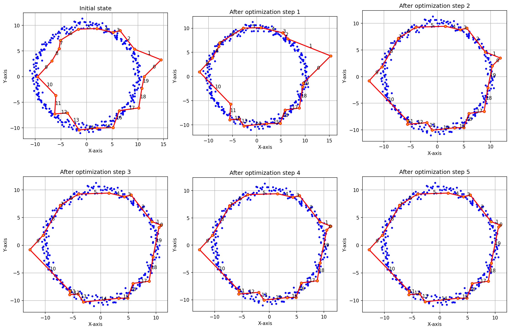

## Results since previous meeting

- Rethought the way edges are grouped and moved together
- Made a Python script to experiment with the edge matching algorithm

## Material for discussion

### Issue with cyclic adjacent buildings

I realized that there could be too many constraints when trying to move multiple edges from multiple buildings at the same time, if we combine grouping almost collinear edges and grouping intersecting buildings.
Below is an illustration of a situation where this issue occurs.

{group="cyclic-adjacent-buildings" height="400px"}

In this figure you can see three buildings that are adjacent to each other, and that share edges with each other.
If we decide that the direction for the green building is towards the inside, then the direction for the blue building will be towards the outside.
But then the direction for the red building cannot be decided.

#### First idea to solve the issue: use a factor for the offset of each edge

I don't think that there is a good solution to this problem.
A potential solution I can think of would be to reduce the constraint that all offsets should have the same length, and use a factor to apply to the offset for each edge.
The factor would be defined as:

- 1 if the edge is part of the main building (the one that we focus on)
- 1 if the edge is part of another building and intersects the main building
- 0 if the edge is part of another building and intersects with another building that is oriented in the same direction.
  Orientation (outside/inside) can be defined as outside for the main building, inside for the buildings that intersect the main building, outside for the buildings that intersect the buildings that intersect the main building, and so on.
  It is like a parity of the distance to the main building, where the distance is defined as the number of buildings in-between.
- For the other edges, a linear interpolation giving a number between 0 and 1 based on the closest 0 and 1 factors.

#### Second idea to solve the issue: rethink the way to group edges and buildings

After thinking more about it I realized that this issue comes from the definition that we use to group edges and buildings.
Currently, we create fixed groups of edges based on the angles between consecutive edges and the intersections between buildings, and we translate groups of edges together.
This is the reason why if a building is circular enough, the whole building can end up in one group, limiting the possibilities to translate the whole building in one direction.

A solution to this would be to create a neighbourhood for each edge, instead of creating fixed groups of edges.
The neighbourhood of an edge would be defined by going through the graph of edges (where edges are connected if they are consecutive in a building or intersect in different buildings), and adding all the edges until we reach an edge which makes an angle bigger than a certain threshold with the initial edge.
If we set the angle to 45 degrees for example, then all the edges in the group would be relatively aligned (no more than 90 degrees between two of them), and we would also ensure that the edges connected to our neighbourhood have at least 45 degrees with the main edge.
This way, we would ensure to have some freedom to move in the direction perpendicular to the main edge.
Finally, to ensure that we don't break the polygons, we would move the edges in a neighbourhood in the same direction, but with a factor that depends on the angle between the edge and the main edge.
This factor would go from 1 for edges that are parallel to the main edge, to 0 for edges that are at the defined threshold angle with the main edge.

Another good property of this solution is that it prevents grouping incompatible buildings.
In the scenario of the figure above, if the main edge is one of the two central edges of the green building, then only a few edges of the blue and red buildings would be in the neighbourhood, and especially not the ones that intersect between the blue and red buildings, which are the ones that create the issue.
It is still possible to imagine scenarios where three buildings could look like they give this cyclic issue, as in the figure below.

{group="seemingly-cyclic-adjacent-buildings" height="400px"}

However, in this case, there is a gap of connectivity in the yellow building: the two edges at the top are connected to the blue building, while the two edges at the bottom are connected to the red building.
And there is no connection in the neighbourhood between the two, except the one that goes through the blue and red buildings, so there is no cycle.
Therefore, if the direction of the main edge is towards the inside, then:

- the direction of the edges in the blue building is towards the inside (connectivity 0),
- the direction of the two edges at the top of the yellow building is towards the outside (connectivity 1),
- the direction of the edges in the red building is towards the outside (connectivity 1),
- the direction of the edges in the yellow building at the bottom is towards the inside (connectivity 2).

We keep this good property as long as the threshold is set to less than 90 degrees.
But this is fine because we probably don't want to group edges that are more than 90 degrees apart anyway.

However, defining the groups/neighbourhoods like this requires to rethink the way we translate the edges, as we cannot anymore translate all the edges in a group with the same offset in their own direction, due to the fact they the last edge in the neighbourhood can be very close in direction to the next edge outside of the neighbourhood.

Therefore, I think have two ideas about how to translate neighbourhoods:

1. Translate all the edges with the same offset and direction.
  Then, if this breaks the topology, move the neighbours where it breaks in the same direction by what is needed to fix the topology, until we don't have any more topology issues.
2. For each building, translate the line that connects both sides of the edge group in the building.
  Then, intersect the translated line with the neighbouring edges to get the new position of the vertices.
  Finally, scale up/down all the edges in the group to fit into the new position of the vertices.

### New edge matching algorithm

The final version of the edge matching algorithm that I have in mind is the following.
Each edge is represented by an oriented line segment.
Its orientation is defined by the order of the edge segments in the polygon that it belongs to.
Each edge is considered individually when matching edges but since moving it can break the topology, its neighbours may also move with it.

When considering a given edge to move, the direction to move it is defined as the direction perpendicular to the edge.
All the neighbours that may move with it also move in the same direction, even though in practice this means moving them in their own perpendicular direction with a factor that depends on the angle between the edge and the neighbour.
Each neighbour may only move in the same direction with a length that is equal or smaller than the length of the offset of the main edge.
Moreover, we try to minimize how many neighbours we move, and how much we move them, as they will all be considered individually and the goal is mainly to move the main edge. without constraints from the neighbours.

The goal is still to maximize the score of the final configuration, taking into account all the edges that we move, and not only the main edge.
Before explaining the algorithm, here are a few interesting facts about this method:

- This method allows to move all the edges in the same direction by the same factor in worst case, which simply results in a full translation of the polygon, which is the best we can do an extreme case.
- Self-intersections create flipped edges, meaning that looking for flipped edges (which is quite easy if the initial orientation of the edges is known) allows to detect when the topology is broken.
  This assumes however that the topology was correct initially.
- Handling touching polygons becomes quite easy, as there is only one direction, and if two edges are touching, they can simply be moved together.

The idea of the algorithm is:

1. Move the main edge with the full given offset in the direction perpendicular to the edge.
2. **Check for flipped edges**:
   1. If there is no flipped edge, then leave.
   2. If the main edge is flipped, move both its neighbours by the same offset in the same direction, and continue.
   3. If a neighbour edge is flipped, move it in the same direction with the same offset, and continue.
3. Go through the edges in the polygon in **backward direction**, and while an edge (previous or current) is flipped, move it in the same direction with the same offset.
4. Go through the edges in the polygon in **forward direction**, and while an edge (previous or current) is flipped, move it in the same direction with the same offset.

I am still trying to figure out a way to improve this algorithm by moving the edges by smaller offsets if possible, but even without this improvement, the algorithm already gives good results, as shown in the example below.

{group="new-algorithm-example" height="400px"}

## Discussion

- I should keep a list of ideas of potential topics that are not a priority but that could be interesting to work on if I have time, such as identifying incorrect buildings that don't really match with the LiDAR HD data.
- Scoring the configurations:
  - The general objectives of reconstruction of buildings outlines are:
    1. Topological complexity -> doesn't matter in our case because we already have a topology we don't want to break
    2. Explain as many points as possible
    3. Minimize the length of the edges
    4. Edges that pass as close as possible to the points
  - I should therefore add a criterion of edge length to minimize in the score, in addition to the criterion of proximity of edges to points.
  - The objectives 2 and 4 can be explained by the same score criterion, which is a score based on the distance of the points to the edges, with a threshold after which the score is 0.
  - To make a compromise between (2, 4) and 3, I could add a parameter $\alpha$ to give more or less importance to one compared to the other in the score.
- Since I want to have an iterative algorithm, I should also formalise an optimization objective to know when to stop iterating.
- The current algorithm is quite good but it is discontinuous, as the neighbours are either moved by the same offset as the main edge, or not moved at all.
  Trying to remove this discontinuity already took me a lot of time, and I will keep looking a bit at it this week, but otherwise I will keep it a further work.
- The final report for the thesis could be a journal article (like ISPRS) instead of a master thesis report.
 
## Work until next meeting

- [x] Create a list of potential topics to work on if I have time
- [x] Add a criterion of edge length to minimize in the score, in addition to the criterion of proximity of edges to points
- [x] Formalise a criterion to know when to stop iterating
- [ ] Try to remove the discontinuity in the polygon adaptation algorithm
- [x] Decide on the format of the final report for the thesis (journal article or master thesis report)
