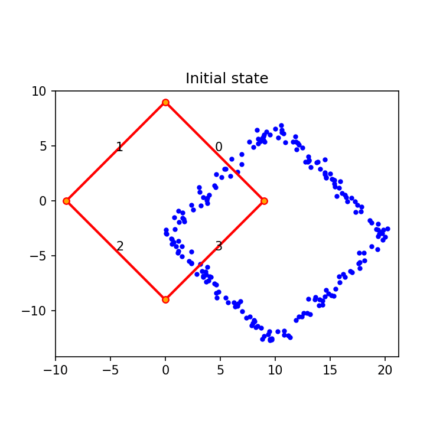
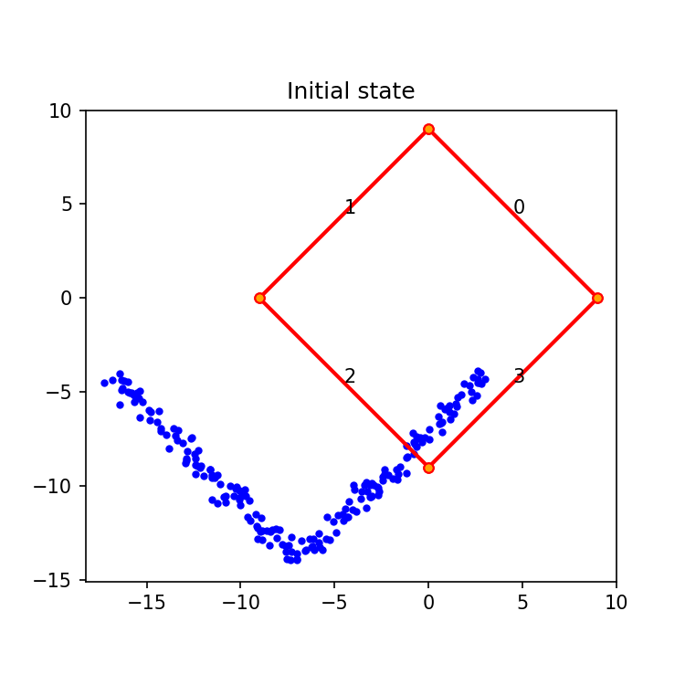
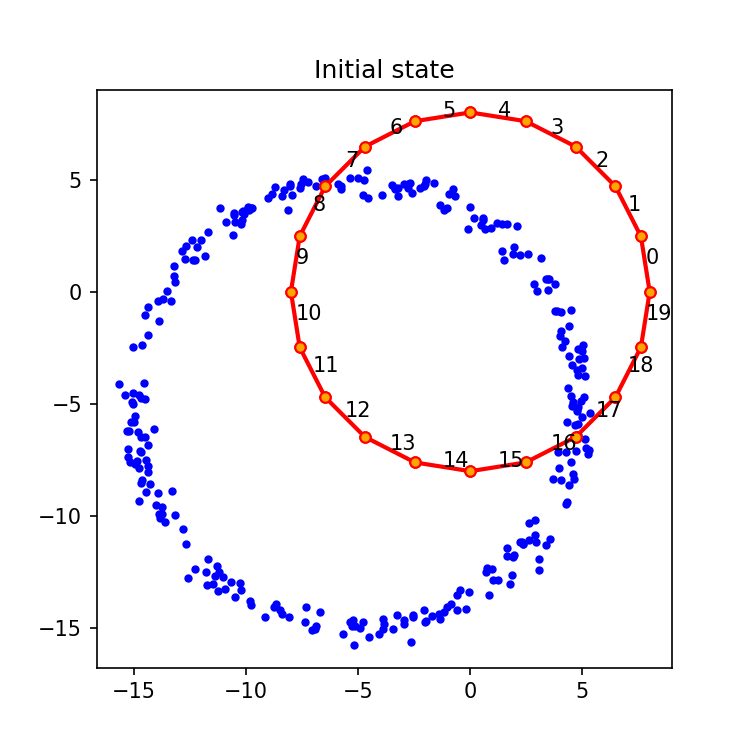
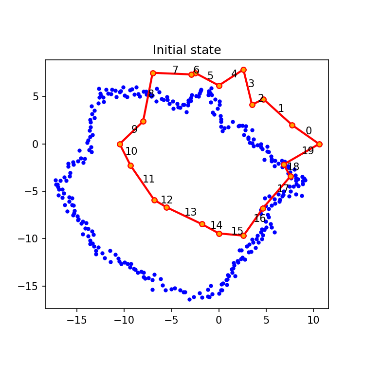

## Results since previous meeting

- Edge matching in Python:
  - Implemented the "simple" version of the edge matching algorithm
  - Restructured the code to be flexible about the different parts of the pipeline which combines:
    - Geometric primitives and operations
    - Functions to create sample data
    - Visualization functions
    - Topological properties and checks
    - A line moving structure which adapts the polygons to the movement of one edge to build valid configurations
    - A criterion to evaluate configurations
- After testing the algorithm in different scenarios, it seems to me that the criterion to score configurations should include different weighted components:
  - A score for the proximity of the edges to the points (which is currently linear with the distance with a threshold)
  - A score to minimize the length of the edges (which is currently the perimeter of the polygons)
  - A score to preserve the initial shape (which is currently the ratio between the current perimeter and the initial perimeter)
- About the criterion to stop the algorithm, I could simply stop when the edges don't move any more (meaning that the sum of the shifts and/or the maximum shift are below certain thresholds).
  On top of that, a maximum number of iterations could be set.

## Material for discussion

### Results edge matching algorithm

:::: {#fig-examples-matching layout="[[1,1], [1,1]]"}

{group="examples-matching"}

{group="examples-matching"}

{group="examples-matching"}

{group="examples-matching"}

:::

## Discussion

## Work until next meeting
