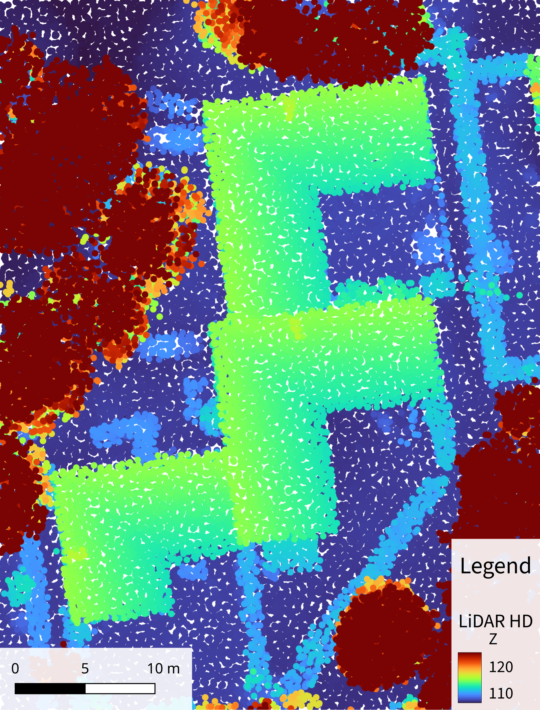
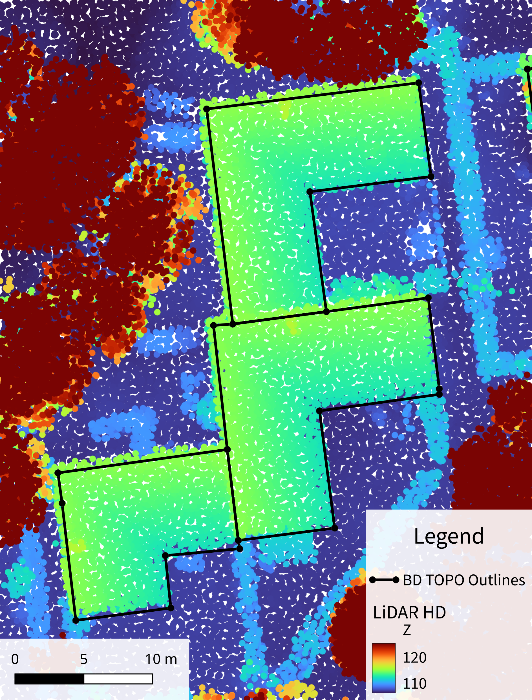
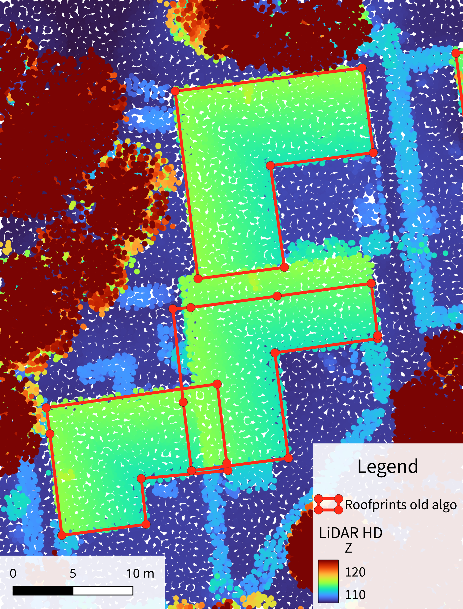
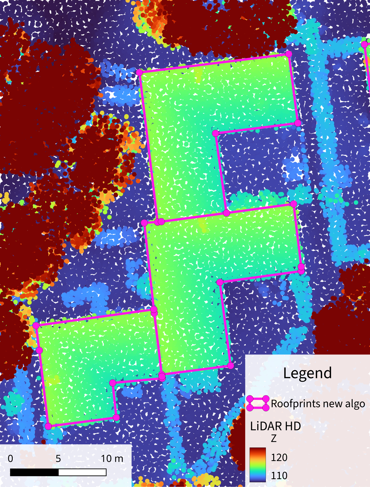
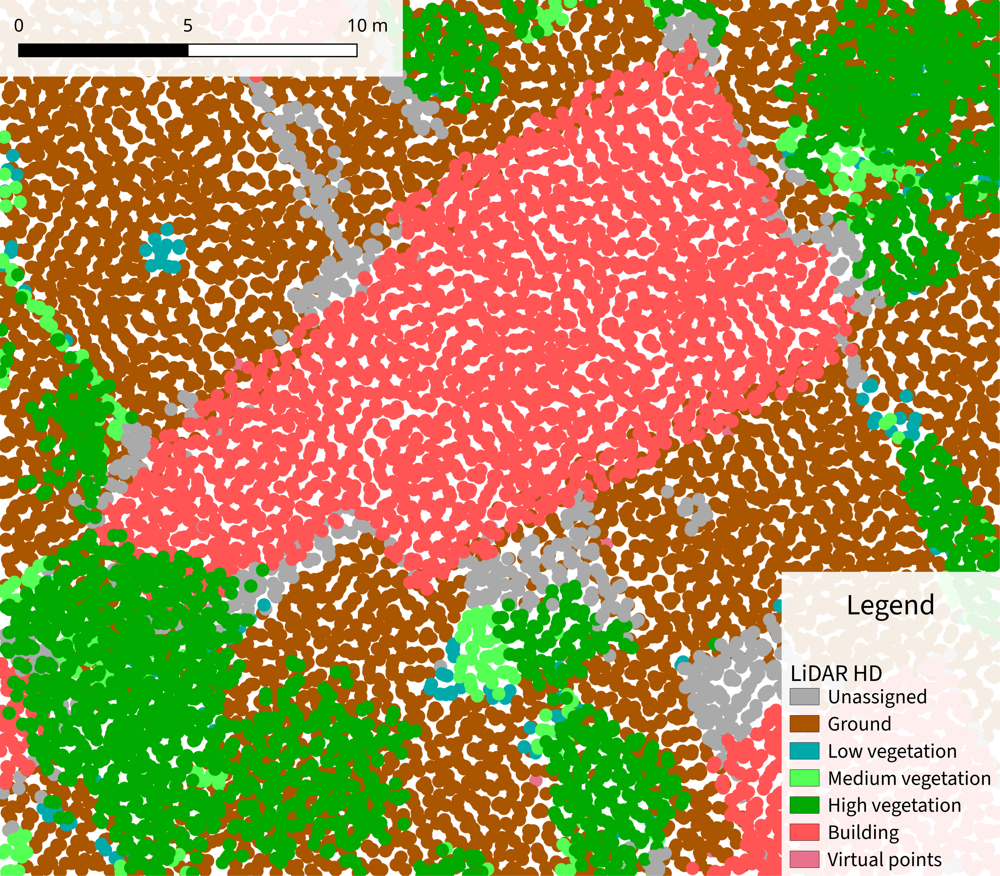
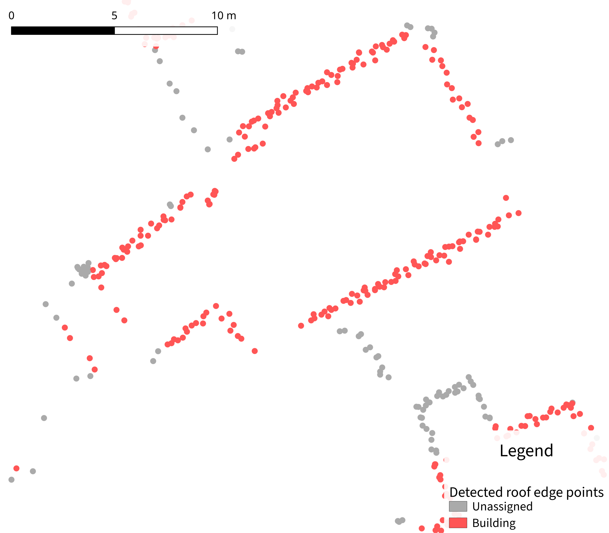
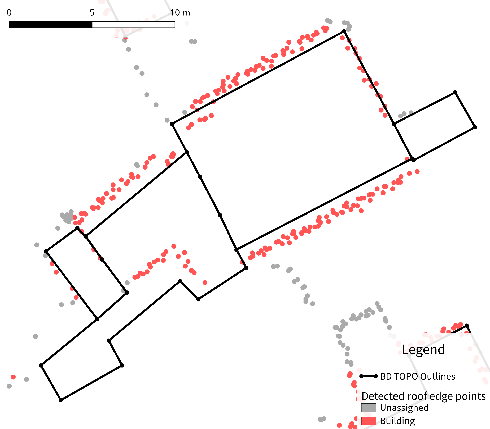
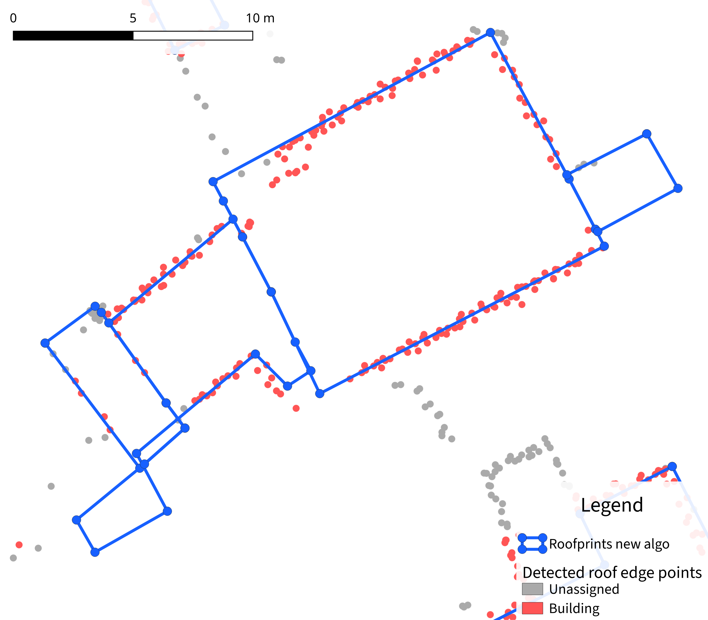

## Results since previous meeting

- Implemented the new edge matching algorithm in C++
- Still experimenting with using the different aspects of the energy

## Material for discussion

### Results of the new algorithm

In the example below, you can see how the touching edges stay collinear, and how this helps the process of shifting them properly.

:::: {#fig-examples-new-algo layout="[[1,1], [1,1]]"}

{group="examples-new-algo"}

{group="examples-new-algo"}

{group="examples-new-algo"}

{group="examples-new-algo"}

Example of the comparison between the old algorithm and the new algorithm for connected buildings.
:::

However, this does not ensure that points that are shared by three or more edges will keep their topology.
In this example we can clearly see two vertices at the boundaries of buildings that were each split in two new vertices at slightly different positions.
This effect can also be responsible for creating overlaps between neighbouring polygons.

Moreover, the way I implemented the algorithm right now only checks for flipped edges.
This means that only "local" self-intersections are found, even though other kinds of self-intersections can happen when shifting some parts of non-convex polygons.
We can see two interesting things in the example below.
First, because one of the edges was shifted too far up without causing issues with its direct neighbours, it managed to create a self-intersection with the other side of the polygon.
Then, when looking at the large rectangle and its connections with its neighbouring buildings, it looks like some topology was lost, because in the bottom part it now goes further than its neighbours.
This is due to not considering shared vertices between buildings, implying that moving the bottom line of the large rectangle does not move the perpendicular line in the neighbour building, even though they are geometrically connected.

:::: {#fig-example-self-intersection layout="[[1,1], [1,1]]"}

{group="example-self-intersection"}

{group="example-self-intersection"}

{group="example-self-intersection"}

{group="example-self-intersection"}

Example of a self-intersection that is still not fixed with the new algorithm.
:::

### Components of the energy

It was discussed previously that there should be something in the energy that encourages the polygons so be as small as possible while fitting on as many points as possible.
However, since we already have outlines and we know that they give a good approximation of what we want in terms of general shape, I wonder if it would not make more sense to emphasize sticking to the initial shape rather than being small.
There are different ways to look at it:

- The area of the polygon
- The perimeter of the polygon
- The area of the subpart of the polygon that we move
- The perimeter of the subpart of the polygon that we move
- The individual differences/ratios of edge lengths
- Even more?

## Discussion

- Three ideas to fix the issues of self-intersections:
  1. Start with a global translation for the whole building unit in order to have less problems later
  2. Add to the energy a metric that tries to preserve the length of edges
  3. Compute intersections on the whole building.
    Since this is potentially costly, it may help to do it only on the best solution if it is possible?
- Documenting extensively the limitations and potential solutions of the method is an important part of the process
- If we actually want to find optimal solutions when computing configurations of the polygons, we could try to solve linear systems that have the individual shift of each line as variables, and inequations enforcing a minimum size for each edge.
- To start working on the façade points:
  - Use the first point after roof edge points
  - Try to use the vertical change in acquisition order to identify vertical structures
  - See if machine learning would be necessary and possible

## Work until next meeting

- Try bracketing in 2D to identify a good first global translation
- Try a metric to preserve the length of edges
- Look into detecting façades
- Prepare the next monthly meeting
