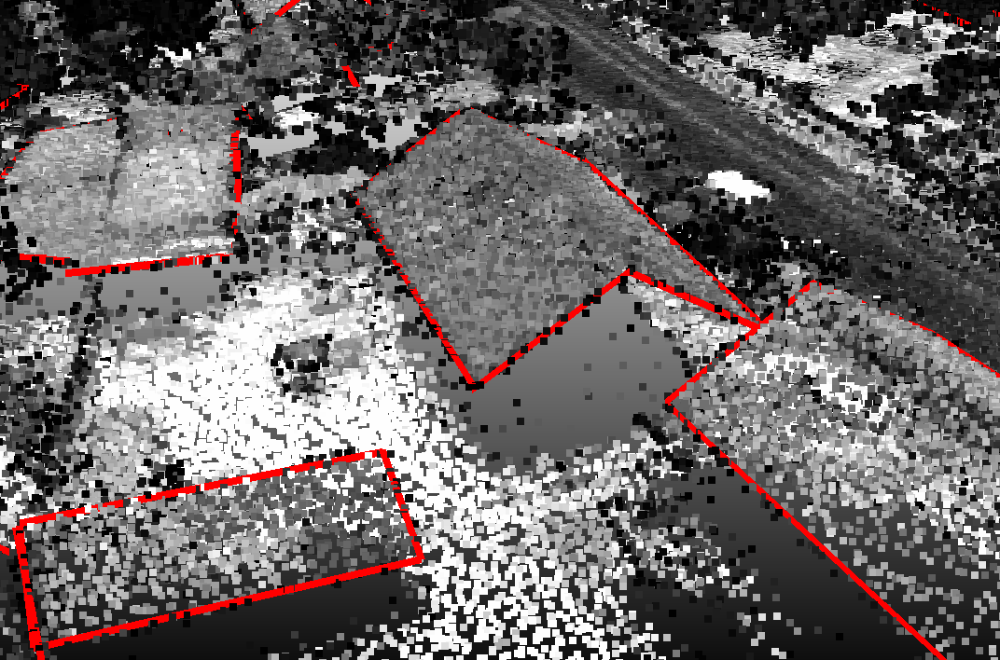
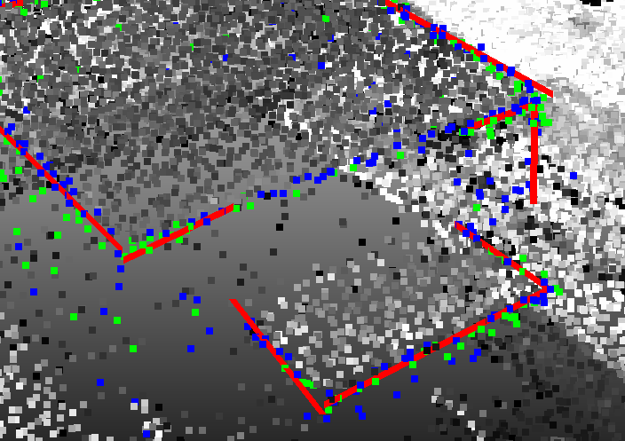
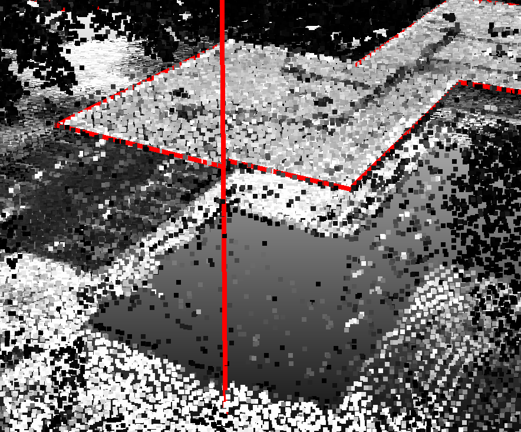
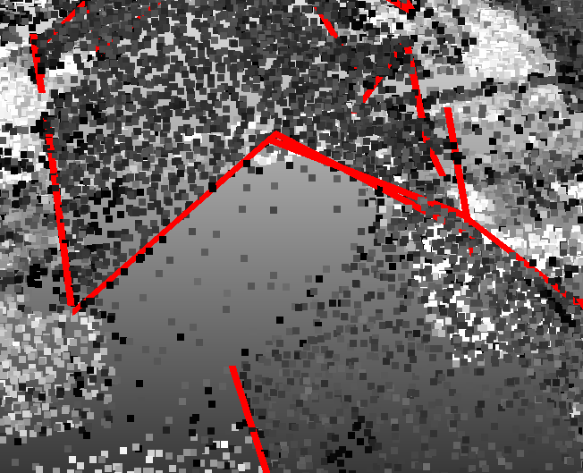

## Results since previous meeting

- Started working on the footprints:
  - Tried a different approach to compute the inward direction on the façades and make them stand out more, but the results are not good enough.
  - Worked a lot on moving the roof edges to 3D after identifying the roofprint.
    I now have a solution that works quite well even if it is not perfect.
    It could help a lot for façades as it better defines the region in which we are looking for façade points.
- I now also use the closest ray (in terms of angle) in the previous and next scan line to compute the distance, allowing to identify more roof edges.
  It could also potentially help to identify points on façades.

## Material for discussion

### Roofprints to 3D

#### Idea

To get the edges of the roofs in 3D, I try to match the roofprints obtained with the previous algorithm with the points identified as roof edges in the point cloud.
We consider that the roofprint is correct, and therefore the 2D projection of the roof edges should give exactly the roofprint.
Therefore, this means that for a given edge in the roofprint, we want to split it into segments, and assign to each end of the segment a Z value.
We can allow discontinuities between two segments, but then a vertical segment will be added to connect them in 3D.

#### Difficulties

There are many reasons why this is not trivial:

- The process to identify roof edge points is far from perfect:
  - It identifies **many points on the façades**.
    Moreover, these points can be very well aligned due to how they were acquired, meaning that they can make a good candidate in 3D.
  - It *can miss many points*, and it is **often all or nothing** for a given roof edge, due to the thresholds we are using.
- **One edge in 2D** in the roofprint can correspond to **many edges in 3D**.
  There are therefore many variables to optimize for: where to split in 2D, and for each segment, select a height and rotation.
- Some edges in the roofprints are **very small**, and therefore it is difficult to find a decent number of points in the point cloud.
- We would like to get a **closed shape** in the end, which means optimizing the whole roofprint at once.
  This can also help to get better results for the small edges.
  But in some situations two neighbouring edges in the roofprint are actually **disconnected in 3D**, which adds complexity.

#### Current solution

My current solution is based on RANSAC to identify potential segments in 3D, and I implemented a custom logic to choose the best combination of segments in 3D.

I work on each edge in the roofprint independently, which is not optimal but was the simplest way to implement it for now.
Then, I extract the points that matched the edge when optimizing the roofprint, and perform RANSAC to identify potential segments in 3D.
I assign them a score based on how well they match with the points in 3D.
Then, I go through these segments in decreasing order of score, and if the space they occupy in 2D is not already fully occupied by a previously selected segment, I add them by merging them with the previously added segments with different rules.
Finally, I extend the segments if needed to occupy the full edge in 2D.

Without diving into the details, it works relatively well, but it is still incomplete and has some caveats:

- The imperfections of roof edge point identification means that the roofprint will sometimes be at the right place but will lack points to match in 3D.
  In this case, I currently skip the edge, which is not ideal.
  A solution could be to instead look into the full point cloud when this happens, as the 2D area is already very well defined by the roofprint.
- The imperfections of the roofprint can also cause issues, as we may be looking for points in the wrong place.
  If we do not find points, we skip the edge which is the best we can do, but if we find points on the façade, we may end up with a very bad result.
  A solution to some extend would be to match the full roofprint at once, as an edge without many points came at this position because of the grouped optimization performed on roofprints.
- Neighbour edges in the roofprint are optimized independently, meaning that they often end up disconnected in 3D by a few centimetres or more.
- When merging multiple segments in 3D to obtain the final shape for one edge in the roofprint, I currently do not look for the best way to merge them in terms of the final score, but instead simply look for a simple geometric rule to merge them.
  This can lead to suboptimal results.

Below are a few illustrations of the results obtained with this method.

:::: {#fig-examples-algo-roofprints-3d layout="[[1,1], [1,1]]"}

{group="examples-algo-roofprints-3d"}

{group="examples-algo-roofprints-3d"}

{group="examples-algo-roofprints-3d"}

{group="examples-algo-roofprints-3d"}

:::

## Discussion

- Meeting did not happen this week, so no discussion.

## Work until next meeting
