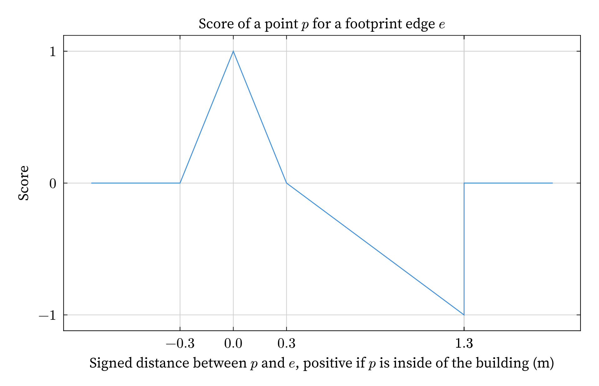
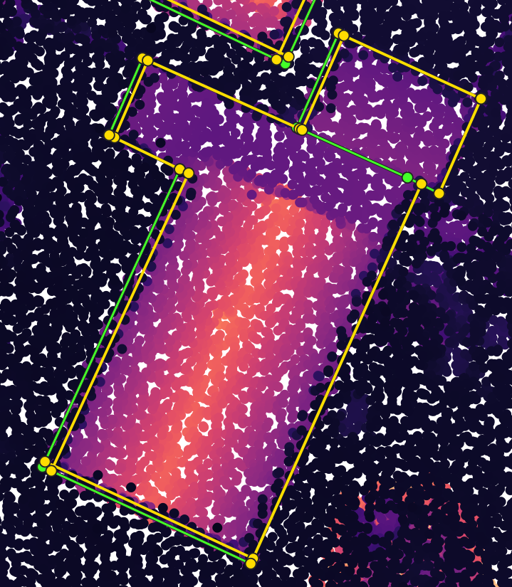
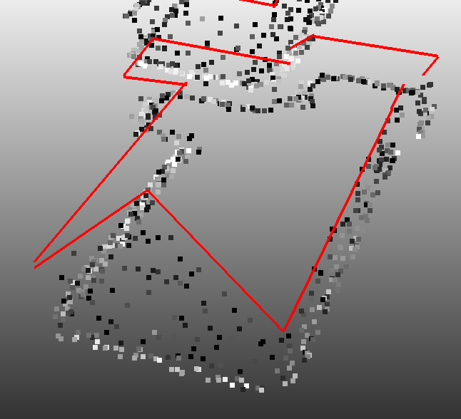
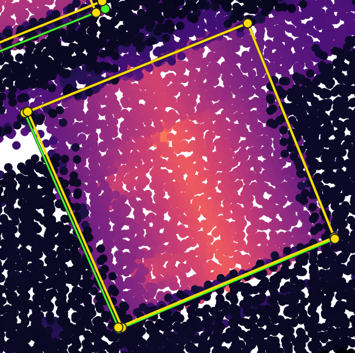
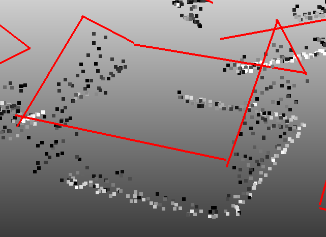

## Results since previous meeting

- I mainly worked on extracting footprints using the 3D roofprints that I managed to get last week.
  More details are given below.
- I also slightly improved the 3D roofprints to get a better output for the roofprints.

## Material for discussion

### Footprints

#### Current process

The current process to get a footprint is quite similar to the process to get the roofprints, except it is much simpler.
I currently work on each edge independently, starting from the edges of the roofprints.
For each edge, I try to shift it perpendicularly with different lengths, and keep the best solution based on a new energy metric.
Working on each edge independently is not ideal, as similarly to the process for the roofprints, it can break the topology and make it harder to build an actual polygon at the end, but it is a good starting point to test the energy metric and see if it gives good results.

This new energy metric is based on the idea that what we care about the most are points on the walls, but we would like to be able to use the points on the ground as well when we are missing points on the walls.
Since we assume walls to be vertical, removing the vertical component leads to clusters of points on the walls, which is very convenient to get high scores for the energy metric.
Regarding ground points, the main idea is that if there are points behind the current plane towards the inside of the building, then we probably want to push it further towards the inside of the building.
The final score can be seen in @fig-footprint-metric.

{#fig-footprint-metric fig-align="center" group="footprint-metric" width="50%"}

The idea here is simple:

- If there are points **close to the edge**, they count **positively**, because they may indicate that the wall is here.
- If there are points **further towards the inside of the building**, they count **negatively**, because they may indicate that the wall is actually further towards the inside of the building.
  However, we have to stop somewhere to make the scores comparable and to prevent issues if roof points are wrongly identified as wall points.

#### Results

The algorithm works as expected in many cases, but there are still situations where we do not get good results.
@fig-examples-algo-footprints show some examples with issues.
The first example is correct except on the right side, where the edge was not moved between the roofprint and the footprint.
The second example shows a similar situation.

:::: {#fig-examples-algo-footprints layout="[[1,1], [1,1]]"}

{group="examples-algo-footprints"}

{group="examples-algo-footprints"}

{group="examples-algo-footprints"}

{group="examples-algo-footprints"}

Examples where it does not work well.
:::

My explanation for this is that the score that I am using rewards being surrounded by points (in its 30 cm radius), and therefore if there are not many points on the walls, it will be rewarded for being 30 cm away from the wall, where there are more points on the ground.
I could maybe fix that by de-symmetrizing the score even more to avoid rewarding having points towards the inside, or by reducing the radius.
Maybe I could also use the negative part of the reward only on points classified as ground, and the positive part on the rest of the points.
The good thing about this idea is that ground points are usually well classified.

### Presentations of my work

We discussed last time about making presentations for other people at IGN, one that would be technical and one that would be more high-level.
We were thinking of having the non-technical one on June 22nd and the other one before the A3 presentation for TU Delft which is on June 12th.

Also I was contacted by someone internally at IGN to discuss how I use the LiDAR HD dataset in my work. 

It would be great if we could decide on dates for these presentations, keeping in mind that the current deadlines are:

- May 6th for a short presentation for the LASTIG internal seminar (not too much details in it)
- June 5th for the MSc thesis report (introduction + preliminary materials + paper + discussion)
- June 12th for the A3 presentation for TU Delft (technical one)
- June 26th for the A4 presentation for TU Delft (non-technical one)

## Discussion

## Work until next meeting
