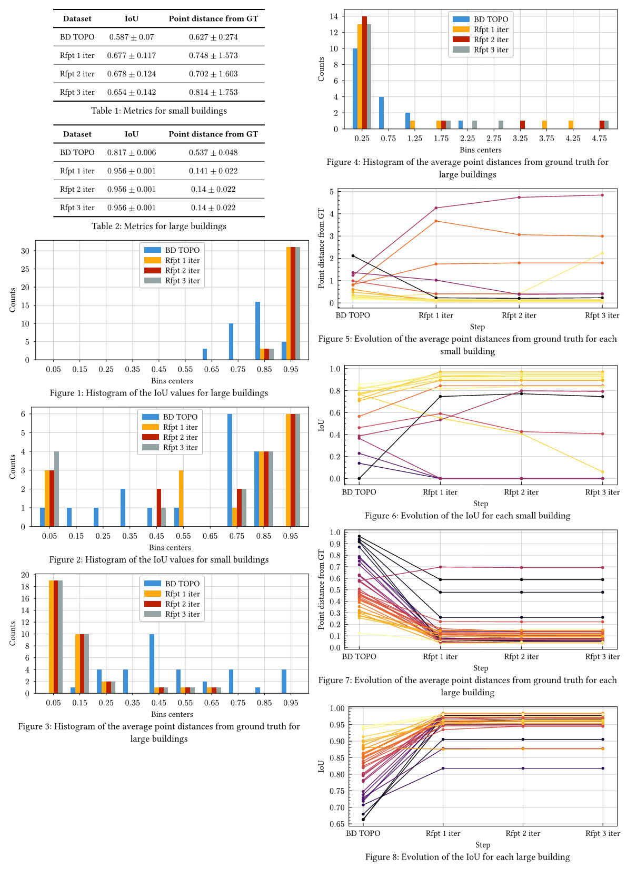

## Results since previous meeting

- Worked on the final MSc thesis report, mostly on its paper part
- Made manual annotations to create a ground-truth dataset of roofprints (no footprints for now)
- Implemented some scores to evaluate the method based on this ground-truth dataset

## Material for discussion

### Criteria to evaluate the polygons

I have currently implemented two criteria:

- Intersection over union (IoU)
- Chamfer distance

Since the polygons are sometimes adjacent and the shared edges can be impossible to find using only geometrical criteria, I think that it could be beneficial to also compute these same criteria after dissolving the polygons which are connected in the ground-truth, in order to evaluate the method on the level of building blocks instead of parcels.

### Visualization of the results

## Discussion

## Work until next meeting

- [ ] Prepare the presentation for the monthly meeting on May 18th
- [ ] Look at the two ideas to evaluate the algorithm:
  - [ ] Ground-truth dataset of roofprints and footprints
  - [ ] Synthetic dataset of LoD 2.3 buildings
- [ ] Integrate roofer into the process to filter the points for the footprints
- [ ] Improve the footprint generation algorithm to handle the whole building at once 